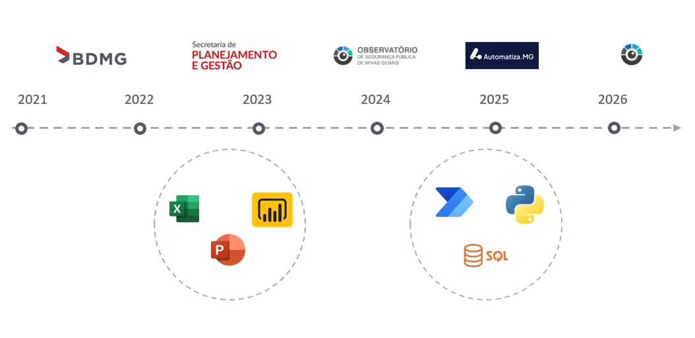

---
slides:
  title: Apresentação Rede Automatiza.MG
---

## Utilizando Python para automatização de rotinas de dados

<!--s-->

## Quem sou eu?


<!--s-->

## Minha trajetória



<!--s-->

<h2 style="margin-top:-80px;">Meu trabalho atual</h2>

<div style="display:flex; align-items:center;">

<div style="width:50%; text-align:center;">


</div>

<div style="width:50%;">

<ul>
<li>Análise Criminal</li>
<li>Divulgação dos dados oficiais de segurança pública no Estado</li>
</ul>

</div>

</div>

<!--s-->

## <span style="position:relative; top:-40px;">O problema</span>

<div style="text-align:center; margin-top:-20px;">
    
</div>

<div style="display:flex; margin-top:40px;">

<div style="width:50%; text-align:center;">

### Situação 1


</div>

<div style="width:50%; text-align:center;">

### Situação 2


</div>

</div>

<!--s-->

<h2 style="margin-top:-70px;">Resultados e produtos</h2>

<div style="display:flex; margin-top:30px;">

<div style="width:45%;">

<h3>Antes</h3>

- Entre 3 e 5 dias de dedicação
- Tarefa repetitiva e sujeita a erros
- 65 planilhas

</div>

<div style="width:45%;">

<h3>Depois</h3>

- 4 horas para rodar a rotina automaticamente
- Erros reduzidos e fáceis de rastrear
- Um repositório no GitHub

</div>

</div>

<div style="text-align:center; margin-top:40px;">
    
</div>

<!--s-->

## Por que eu escolhi Python?

<div style="
background:#1e1e1e;
padding:20px;
border-radius:8px;
font-family:Consolas;
font-size:0.8em;
text-align:left;
">

<span style="color:#C586C0">motivos</span> = [

&nbsp;&nbsp;&nbsp;&nbsp;<span style="color:#CE9178">"automação"</span>,

&nbsp;&nbsp;&nbsp;&nbsp;<span style="color:#CE9178">"análise de dados"</span>,

&nbsp;&nbsp;&nbsp;&nbsp;<span style="color:#CE9178">"linguagem versátil"</span>,

&nbsp;&nbsp;&nbsp;&nbsp;<span style="color:#CE9178">"linguagem mais natural"</span>,

&nbsp;&nbsp;&nbsp;&nbsp;<span style="color:#CE9178">"equipe incipiente"</span>

]

</div>

<!--s-->

## Lições da minha jornada

- Não é fácil, mas também não é impossível
- Sobre o uso de IA


<!--v-->

## Lições da minha jornada

- Um oceano de possibilidades


<!--s-->

## O que eu recomendo

- Mão na massa
- Comunidades
- Ferramentas que uso/indico

<div style="margin-top:40px; text-align:center;">


</div>

<!--s-->

```python
print(Obrigado!)
```

