---
slides:
  title: Apresentação Rede Automatiza.MG
---

## Utilizando Python para automatização de rotinas de dados

<!--s-->

<h2 style="
margin-top:-20px;
font-size:1.3em;
">
Quem sou eu?
</h2>

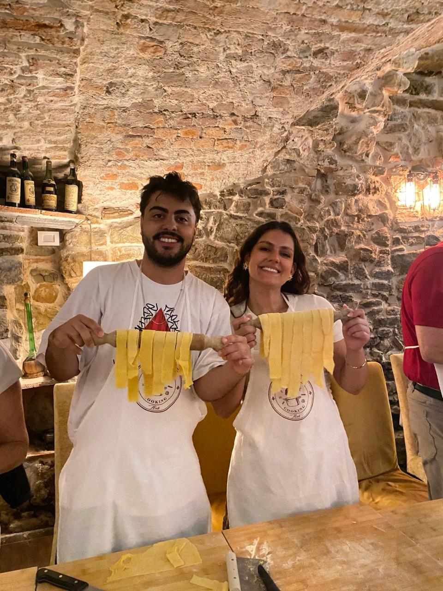

🦊🔵⚽🏓📚📰👨‍🍳🗺️🗞️💻🤖

<!--s-->

<h2 style="
margin-top:-20px;
font-size:1.3em;
">
Minha trajetória
</h2>

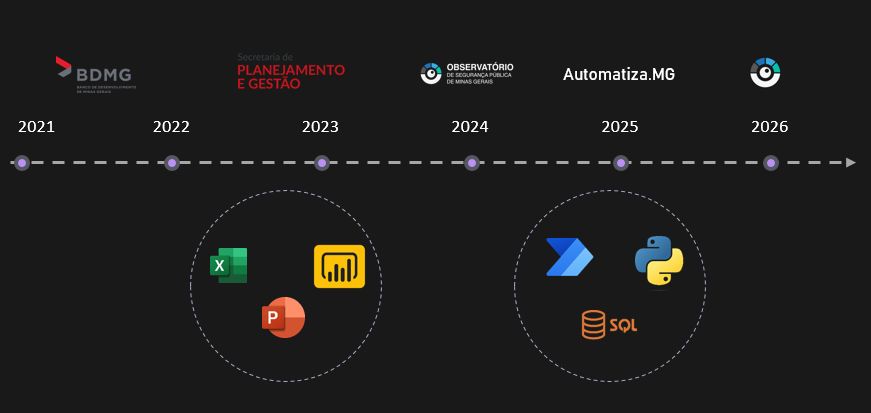

<!--s-->

<h2 style="
margin-top:-20px;
font-size:1.3em;
">
Meu trabalho atual
</h2>

<div style="display:flex; align-items:center;">

<div style="width:50%; text-align:center;">


</div>

<div style="width:50%; font-size:0.6em;">

<ul>
<li>Análise Criminal</li>
<li>Divulgação dos dados oficiais de segurança pública no Estado</li>
</ul>

</div>

</div>

<!--s-->

<h2 style="
margin-top:-20px;
font-size:1.3em;
">
O problema
</h2>

<div style="text-align:center;">
    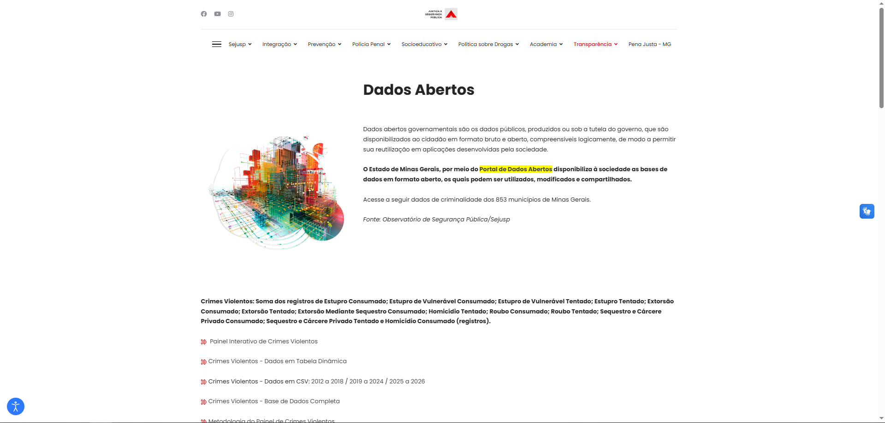
</div>

<div style="display:flex; justify-content:center; margin-top:20px;">

<div style="width:45%; text-align:center;">

<h3>Antes</h3>

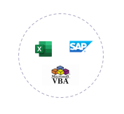

</div>

<div style="width:45%; text-align:center;">

<h3>Hoje</h3>

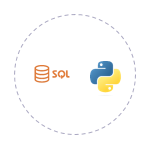

</div>

</div>

<!--s-->

<h2 style="
margin-top:-20px;
font-size:1.3em;
">
Resultados e produtos
</h2>

<div style="display:flex; justify-content:center;">

<div style="width:42%;">

<h3 style="font-size:0.8em;">Antes</h3>

<ul style="font-size:0.75em;">
<li>Entre 3 e 5 dias de dedicação</li>
<li>Tarefa repetitiva e sujeita a erros</li>
<li>65 planilhas</li>
</ul>

</div>

<div style="width:42%;">

<h3 style="font-size:0.8em;">Depois</h3>

<ul style="font-size:0.75em;">
<li>4 horas para rodar a rotina automaticamente</li>
<li>Erros reduzidos e fáceis de rastrear</li>
<li>Repositório no GitHub e painel</li>
</ul>

</div>

</div>

<div style="display:flex; justify-content:center; margin-top:15px;">

<div style="width:45%; text-align:center;">
    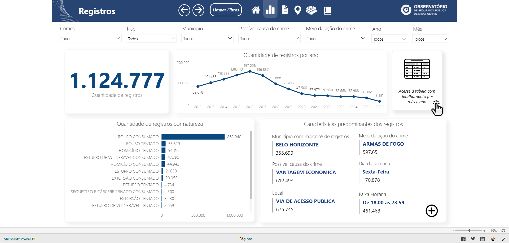
</div>

<div style="width:45%; text-align:center;">
    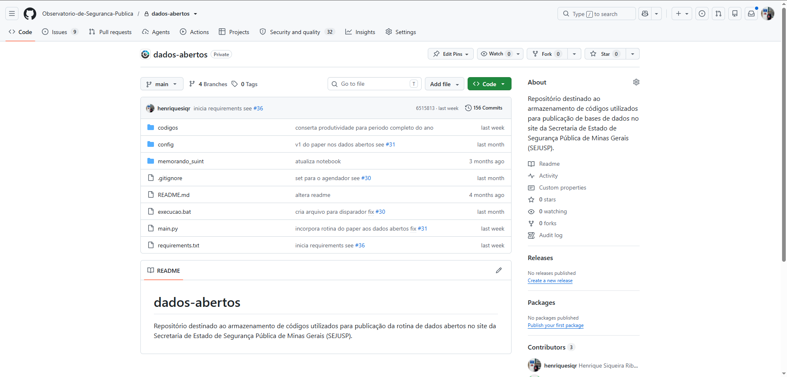
</div>

</div>

<!--s-->

<h2 style="
margin-top:-20px;
font-size:1.3em;
">
Por que eu escolhi Python?
</h2>

<div style="
background:#1e1e1e;
padding:20px;
border-radius:8px;
font-family:Consolas;
font-size:0.8em;
text-align:left;
">

<span style="color:#C586C0">motivos</span> = [

&nbsp;&nbsp;&nbsp;&nbsp;<span style="color:#CE9178">"automação"</span>,

&nbsp;&nbsp;&nbsp;&nbsp;<span style="color:#CE9178">"análise de dados"</span>,

&nbsp;&nbsp;&nbsp;&nbsp;<span style="color:#CE9178">"linguagem versátil"</span>,

&nbsp;&nbsp;&nbsp;&nbsp;<span style="color:#CE9178">"linguagem mais natural"</span>,

&nbsp;&nbsp;&nbsp;&nbsp;<span style="color:#CE9178">"equipe incipiente"</span>

]

</div>

<!--s-->

<h2 style="
margin-top:-20px;
font-size:1.3em;
">
Lições da minha jornada
</h2>

- Não é fácil, mas também não é impossível
- Sobre o uso de IA

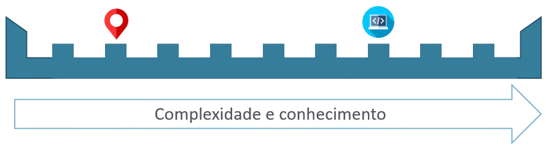

<!--v-->

<h2 style="
margin-top:-20px;
font-size:1.3em;
">
Lições da minha jornada
</h2>

- Um oceano de possibilidades

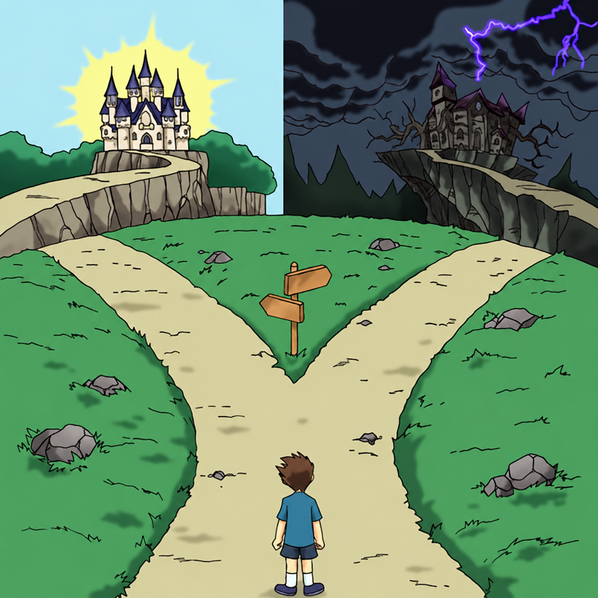

<!--s-->

<h2 style="
margin-top:-20px;
font-size:1.3em;
">
O que eu recomendo
</h2>

- Mão na massa
- Comunidades
- Ferramentas que uso/indico

<div style="margin-top:40px; text-align:center;">


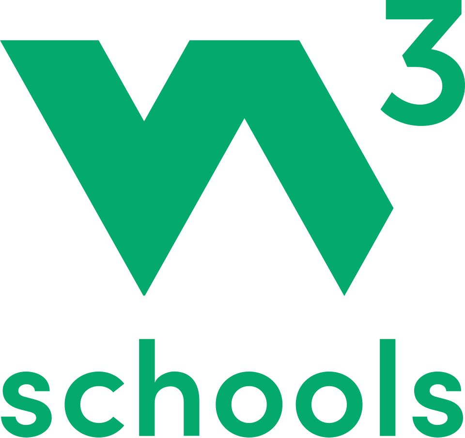
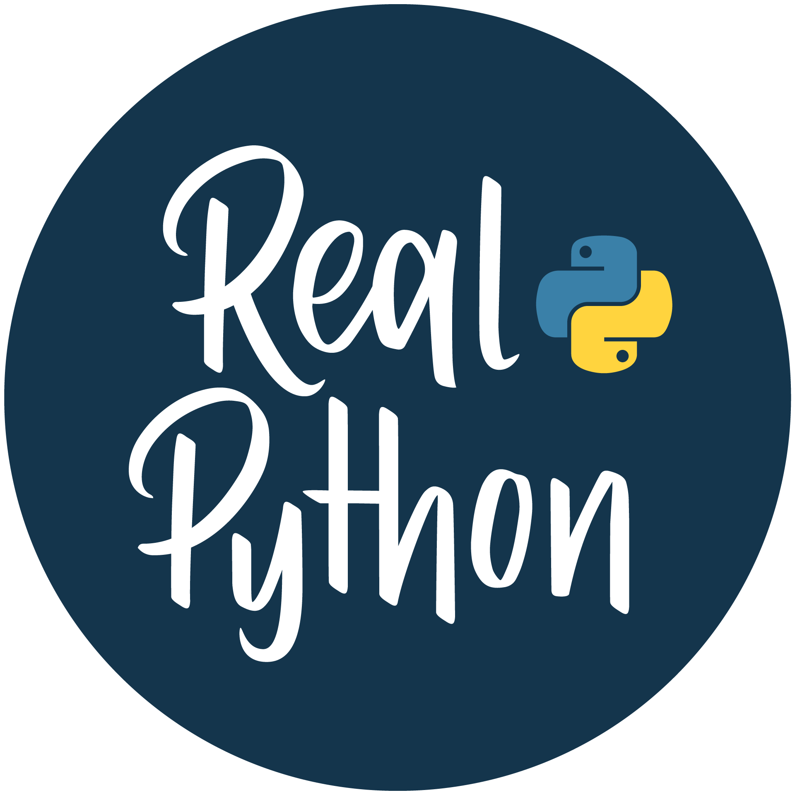

</div>

<!--s-->

```python
print(Obrigado!)
```

